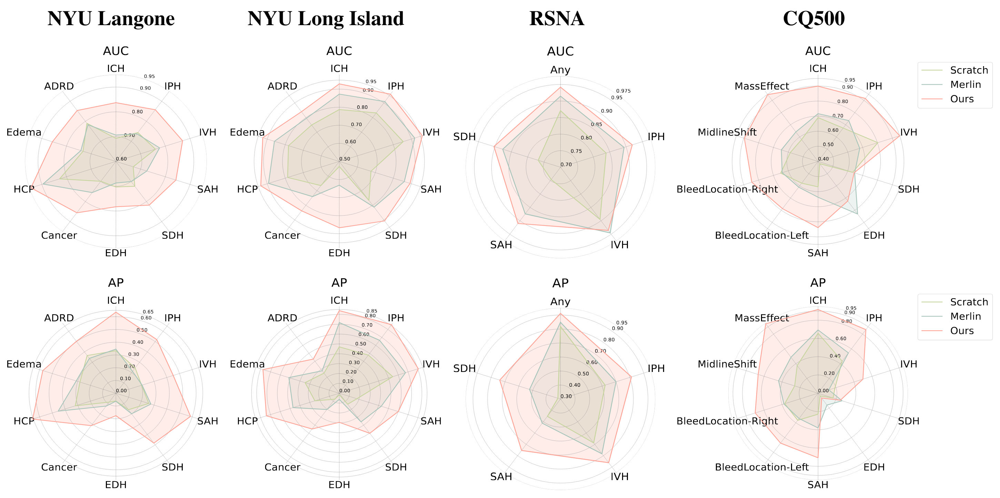
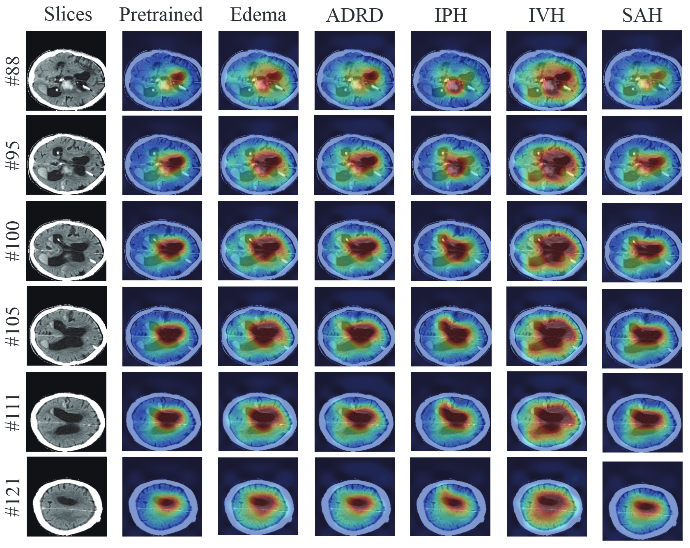

# HeadCT-Foundation
**Abstract:** Head computed tomography (CT) is a widely-used imaging modality for assessing brain, skull, and cerebrovascular pathologies, particularly in neurologic emergencies due to its speed, safety, and accessibility. However, its limited sensitivity compared to MRI and the scarcity of annotated data hinder the development of robust diagnostic models. To address this, we propose a novel head CT foundation model using self-supervised learning on 361,663 non-contrast 3D head CT scans. Our approach leverages self-supervised learning to pre-train a model that learns generalizable features from unlabeled data, followed by fine-tuning on smaller annotated datasets for tasks like hemorrhage and tumor detection. Evaluated on internal and external datasets, the model demonstrates superior performance on downstream tasks and strong generalization across in- and out-of-distribution data. This work establishes a new benchmark for head CT analysis, highlighting the potential of scaling self-supervised learning in 3D medical imaging.


## Installation
1. Create environment with conda:
```
conda create -n head_ct python=3.8.18 -y
conda activate head_ct
```
2. Clone the repository:
```
git clone https://github.com/NYUMedML/HeadCT-Foundation
cd HeadCT-Foundation
```
3. Install dependencies:
```
pip install --upgrade pip
pip install -r requirement.txt
pip install -e .
```

## Starter Notebook
See [**./notebooks/extract_feature_sample.ipynb**](./notebooks/extract_feature_sample.ipynb) to get started of how to load data, model weights and extract features from head CT scans. See [**./notebooks/visualization_sample.ipynb**](./notebooks/visualization_sample.ipynb) to find how to load and visualize volumetric head CT scan.

## Train Model
We present how to run different downstream training and pre-training methods in root directory of this repository with different specified hyperparameters. For more details on pre-defined hyperparameters and their usage, please check [**./config.py**](./config.py) and called ``yaml`` files (e.g.  [**./configs/downstream/vit_HeadCT_cq500.yaml**](./configs/downstream/vit_HeadCT_cq500.yaml) for ``--cfg ./configs/downstream/vit_HeadCT_cq500.yaml``)

We additionally present examples of submitting jobs to Slurm Workload Manager in [**./slurm_submit**](./slurm_submit)

### Train Model for Downstream

#### Fine-tuning
```
torchrun --nnodes 1 --nproc_per_node 1 --master_port 12400 ./main_downstream.py --local_rank 0 \
    --model_name "vit" --batch_size 64 --num_workers 4 --max_epochs 10 --base_lr 1e-5 \
    --cfg ./configs/downstream/vit_HeadCT_cq500.yaml \
    --optimizer "AdamW" --scheduler "cosine" --weight_decay 0.01 --grad_clip 1.0 \
    --preds_save_name "cq500_ICH_finetune" --use_amp \
    --classifier "linear" --label_name "ICH" --dataset "cq500" --seed 42 \
    --filename "cq500_ICH"
```

#### Linear-probing
Add ``--freeze`` to command arguments will only update weights for classification layer:
```
torchrun --nnodes 1 --nproc_per_node 1 --master_port 12400 ./main_downstream.py --local_rank 0 \
    --model_name "vit" --batch_size 64 --num_workers 4 --max_epochs 10 --base_lr 1e-5 \
    --cfg ./configs/downstream/vit_HeadCT_cq500.yaml \
    --optimizer "AdamW" --scheduler "cosine" --weight_decay 0.01 --grad_clip 1.0 \
    --preds_save_name "cq500_ICH_linear_prob" --use_amp \
    --classifier "linear" --label_name "ICH" --dataset "cq500" --seed 42 \
    --filename "cq500_ICH" --freeze
```

#### Few-shots
Add ``--few_shots <num_shots>`` to command arguments will perform few shots with ``<num_shots>`` positive samples for selected disease:
```
torchrun --nnodes 1 --nproc_per_node 1 --master_port 12400 ./main_downstream.py --local_rank 0 \
    --model_name "vit" --batch_size 64 --num_workers 4 --max_epochs 10 --base_lr 1e-5 \
    --cfg ./configs/downstream/vit_HeadCT_cq500.yaml \
    --optimizer "AdamW" --scheduler "cosine" --weight_decay 0.01 --grad_clip 1.0 \
    --preds_save_name "cq500_ICH_fewshots_8" --use_amp \
    --classifier "linear" --label_name "ICH" --dataset "cq500" --seed 42 \
    --filename "cq500_ICH" --few_shots 8
```

### Pre-train Model

#### DINO Pre-training
```
torchrun --nnodes 1 --nproc_per_node 1 --master_port 12400 ../main_pretrain_dino.py --local_rank 0 \
    --model_name "dino" --batch_size 64 --num_workers 4 --max_epochs 1000 --base_lr 1.5e-4 \
    --cfg ../configs/dino/dino_HeadCT.yaml \
    --use_amp --optimizer "AdamW" --scheduler "cosine" --weight_decay 5e-3 \
    --grad_clip 3.0
```

#### MAE Pre-training
```
torchrun --nnodes 1 --nproc_per_node 1 --master_port 12400 ../main_pretrain_mae.py --local_rank 0 \
    --model_name "mae" --batch_size 256 --num_workers 4 --max_epochs 400 --base_lr 1.5e-4 \
    --cfg ../configs/mae/mae_HeadCT.yaml \
    --use_amp --optimizer "AdamW" --scheduler "cosine" --weight_decay 5e-3 \
    --grad_clip 3.0
```

## Comparisons and Benchmarks
We present a comparison among our model, [**Merlin**](https://arxiv.org/abs/2406.06512) (a 3D vision-language model pre-trained on large-scale abdominal CT) and model trained from scratch in the Radar Plot, where we show our model outperform others in large margin across majority of diseases. This highlights the importance of our domain specific large-scale pre-training.



## Attention Map Visualization
We present our model attention map visualization here across slices of scan for different diseases, where our model can attention to important region of diagnosing diseases.



## Citation
If you find this repository useful, please consider citing this paper:
```
@article{,
  title={Foundation AI Model for Generalizable Disease Detection in Head Computed Tomography}
}
```
